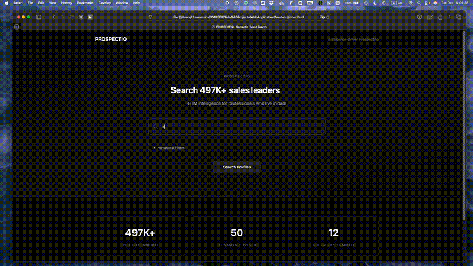
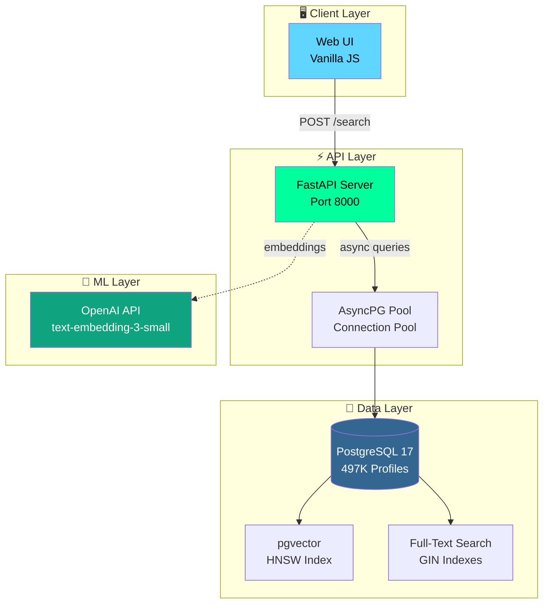

<div align="center">

# PROSPECTIQ

### Intelligence-Driven Prospecting Platform

**Search 497K+ LinkedIn profiles with semantic search and lightning-fast queries**

[](LICENSE)
[](https://python.org)
[](https://postgresql.org)
[](https://fastapi.tiangolo.com)

[Features](#-features) • [Quick Start](#-quick-start) • [Deployment](#-deployment-roadmap) • [API](#-api-endpoints) • [Architecture](#-architecture)

</div>

---

## 🎬 Live Demo

<div align="center">



*Semantic talent search with real-time filtering and CSV export*

</div>

---

## 🎯 Overview

PROSPECTIQ is a production-ready talent intelligence platform designed for GTM teams, recruiters, and data-driven professionals. Built on PostgreSQL 17 with pgvector, it delivers sub-second semantic searches across hundreds of thousands of professional profiles.

### **What You Get**

- 🔍 **Semantic Search** - Natural language queries with vector embeddings (OpenAI text-embedding-3-small)
- ⚡ **Sub-second Performance** - Optimized hybrid search (80% vector + 20% lexical)
- 📊 **Rich Data** - 15+ fields including summaries, skills, social profiles, and contact info
- 🎨 **Modern UI** - Sleek dark theme with advanced filtering and real-time results
- 📤 **CSV Export** - Bulk export up to 10,000 profiles for CRM integration
- 🚀 **Production Ready** - 497K+ profiles loaded and indexed

---

## ✨ Features

### **Current Status: PRODUCTION READY** ✅

<table>
<tr>
<td width="33%" valign="top">

**Search & Discovery**
- [x] Semantic search with vector embeddings
- [x] Full-text search (name, title, company, summary)
- [x] Hybrid ranking (vector + lexical)
- [x] Multi-filter support (location, industry, skills, experience)
- [x] Pagination (20/50/100 results per page)
- [x] Query time: 500-1000ms

</td>
<td width="33%" valign="top">

**Data & Export**
- [x] 497,552 profiles indexed
- [x] 15+ data fields per profile
- [x] CSV/NDJSON export (up to 10K rows)
- [x] LinkedIn, Twitter, GitHub profiles
- [x] Professional summaries
- [x] Skills arrays with 30+ skills per profile

</td>
<td width="33%" valign="top">

**Authentication & API** 🆕
- [x] User registration and login
- [x] JWT-based authentication (24h/30d tokens)
- [x] API key generation with scopes
- [x] Tiered rate limiting (200-1000 req/min)
- [x] Dashboard for key management
- [x] Secure password hashing (bcrypt)

</td>
</tr>
</table>

### **Data Fields (15+ Columns)**

| Category | Fields |
|----------|--------|
| **Identity** | First Name, Last Name, Full Name |
| **Professional** | Job Title, Company, Industry, Years Experience |
| **Location** | Country, Region, City, Full Location |
| **Contact** | Email, Phone, LinkedIn URL, Website |
| **Social** | Twitter, GitHub |
| **Details** | Headline, Professional Summary, Skills (array) |
| **Metadata** | Quality Score, Data Completeness %, Created/Updated timestamps |

---

## 🚀 Quick Start

### **Prerequisites**

- Docker Desktop (for PostgreSQL + pgvector)
- Python 3.11+ with Poetry
- ~21 GB disk space
- OpenAI API key (for embeddings)

### **1. Clone & Setup**

```bash
# Clone the repository
git clone <your-repo-url>
cd WebApplication

# Install Python dependencies
poetry install

# Copy environment template
cp .env.example .env
# Edit .env and add your OPENAI_API_KEY
```

### **2. Start Services**

```bash
# Start PostgreSQL + FastAPI backend
./start_api.sh

# The database is already loaded with 497K profiles!
```

### **3. Open Web Interface**

```bash
# Serve frontend (Next.js dev server)
cd frontend && npm install && npm run dev

# Then open in browser
open http://localhost:5500
```

### **4. Create Account & API Key**

```bash
# Open login page
open http://localhost:5500/login

# 1. Register a new account
# 2. Login to access dashboard
# 3. Create API key with scopes (search:read, export:read, pii:read)
# 4. Copy API key (shown only once!)
```

### **5. Search & Export**

**Web Interface:**
1. Enter keywords: *"senior software engineer"*, *"product manager"*, *"data scientist"*
2. Apply filters: US States, Industries, Experience range, Skills
3. View results with full summaries and contact information
4. Export to CSV/NDJSON for CRM integration (HubSpot, Salesforce, etc.)

**API Access:**
```bash
# Use your API key to search programmatically
curl -X POST http://localhost:8000/search \
  -H "X-API-Key: your-api-key-here" \
  -H "Content-Type: application/json" \
  -d '{"query": "senior software engineer", "limit": 100}'
```

---

## 🏗️ Architecture

### **Technology Stack**

```
┌─────────────────────────────────────────────────────────────┐
│                      PROSPECTIQ STACK                       │
├─────────────────────────────────────────────────────────────┤
│  Frontend   │ Vanilla JavaScript + HTML5 + CSS3             │
│             │ → No framework dependencies                   │
│             │ → Modern dark theme UI                        │
│             │ → Real-time search with filters               │
├─────────────────────────────────────────────────────────────┤
│  Backend    │ FastAPI (Python 3.11+)                        │
│             │ → Async/await with asyncpg                    │
│             │ → Connection pooling                          │
│             │ → Pydantic data validation                    │
├─────────────────────────────────────────────────────────────┤
│  Database   │ PostgreSQL 17 + pgvector                      │
│             │ → HNSW vector index (1536 dimensions)         │
│             │ → GIN full-text search indexes                │
│             │ → Composite indexes for performance           │
├─────────────────────────────────────────────────────────────┤
│  ML/AI      │ OpenAI text-embedding-3-small                 │
│             │ → 1536-dimensional embeddings                 │
│             │ → Semantic similarity search                  │
│             │ → Batch processing for efficiency             │
└─────────────────────────────────────────────────────────────┘
```

### **System Architecture**



### **Search Flow**

```
User Query: "senior software engineer in NYC"
    ↓
1. Generate embedding vector (1536 dims) via OpenAI API
    ↓
2. Hybrid Search (PostgreSQL):
   - Vector Search (80%): Cosine similarity using pgvector HNSW index
   - Lexical Search (20%): Full-text search on title/summary using GIN
    ↓
3. Apply Filters:
   - Location: New York, United States
   - Experience: min_years_experience, max_years_experience
   - Industry: industries[] array
   - Skills: skills[] array (AND logic)
    ↓
4. Rank & Paginate:
   - Combined score = (0.8 × vector_similarity) + (0.2 × ts_rank)
   - Return top 100 results with offset
    ↓
5. Response (500-1000ms):
   - results[] array with 15+ fields
   - total_count for pagination
   - filters_applied summary
```

---

## 🚢 Deployment Roadmap

### **Phase 1: Local Development** ✅ **CURRENT**

**Status**: Production-ready with 497K profiles

- **Infrastructure**: Docker Compose (PostgreSQL)
- **Data**: 497,552 profiles loaded
- **Performance**: 500-1000ms queries
- **Cost**: $0 (local)
- **Best for**: Development, testing, demos

### **Phase 2: Cloud MVP (1M Profiles)** 🎯 **NEXT**

**Target**: Deploy to cloud with 1M best profiles

<table>
<tr>
<td width="33%">

**Option A: Railway** ⭐ **Recommended**

```bash
# 1-command deployment
railway login
railway init
railway add postgresql
railway up
```

**Pros:**
- One-click PostgreSQL
- Auto-scaling
- Easy setup
- Built-in SSL

**Cost:** ~$25-50/month

</td>
<td width="33%">

**Option B: Render**

```yaml
# render.yaml
services:
  - type: web
    name: prospectiq-api
    env: python
    buildCommand: poetry install
    startCommand: uvicorn backend.api.app:app

databases:
  - name: prospectiq-db
    plan: standard
```

**Pros:**
- Free tier available
- PostgreSQL included
- Auto-deploys from git

**Cost:** ~$20-40/month

</td>
<td width="33%">

**Option C: Fly.io**

```bash
# Fly.io deployment
fly launch
fly postgres create
fly deploy
```

**Pros:**
- Global edge network
- Free allowance
- PostgreSQL clusters

**Cost:** ~$15-30/month

</td>
</tr>
</table>

**Phase 2 Checklist:**

- [ ] Extract 1M best profiles (use `scripts/prepare_1m_dataset.py`)
- [x] Add authentication (JWT tokens) ✅
- [x] API key generation with scopes ✅
- [x] User dashboard for key management ✅
- [ ] Implement rate limiting (tier-based with Redis)
- [ ] Setup environment variables management (secrets manager)
- [ ] Enable HTTPS (auto via Railway/Render)
- [ ] Configure CORS for production domain
- [ ] Add monitoring (Sentry/LogRocket)
- [ ] Setup automated backups

### **Phase 3: Production Scale (10M-51M Profiles)** 🚀 **FUTURE**

**Target**: Enterprise-grade with full 51M dataset

```
┌─────────────────────────────────────────────────────────────┐
│                    AWS PRODUCTION STACK                     │
├─────────────────────────────────────────────────────────────┤
│  CDN            │ CloudFront (global edge caching)          │
├─────────────────────────────────────────────────────────────┤
│  Load Balancer  │ Application Load Balancer (ALB)           │
│                 │ → Auto-scaling FastAPI containers         │
├─────────────────────────────────────────────────────────────┤
│  Compute        │ ECS Fargate (4-16 containers)             │
│                 │ → Horizontal auto-scaling                 │
├─────────────────────────────────────────────────────────────┤
│  Database       │ RDS PostgreSQL 17 (db.r6g.2xlarge)        │
│                 │ → Multi-AZ for high availability          │
│                 │ → 100GB-500GB storage                     │
│                 │ → Read replicas for scaling               │
├─────────────────────────────────────────────────────────────┤
│  Cache          │ ElastiCache Redis (cache.r6g.large)       │
│                 │ → Query result caching (5min TTL)         │
│                 │ → Deduplication bloom filters             │
├─────────────────────────────────────────────────────────────┤
│  Storage        │ S3 (Parquet files)                        │
│                 │ → 51M profiles source data                │
│                 │ → Incremental update pipeline             │
└─────────────────────────────────────────────────────────────┘
```

**Infrastructure as Code:**

```bash
# Deploy with Terraform
cd infrastructure/terraform
terraform init
terraform plan -var-file=production.tfvars
terraform apply

# Expected resources:
# - VPC with public/private subnets
# - RDS PostgreSQL 17 (Multi-AZ)
# - ECS Fargate cluster (auto-scaling)
# - Application Load Balancer
# - CloudFront distribution
# - ElastiCache Redis cluster
# - S3 buckets (data + backups)
```

**Phase 3 Features:**

- **Performance**: <200ms queries with Redis caching
- **Availability**: 99.9% uptime (Multi-AZ RDS)
- **Scalability**: Auto-scaling 4-16 containers based on load
- **Security**: VPC, security groups, IAM roles, SSL/TLS
- **Monitoring**: CloudWatch, X-Ray tracing, custom dashboards
- **Backups**: Automated daily snapshots + point-in-time recovery

**Cost Estimate (AWS):**

| Service | Specs | Monthly Cost |
|---------|-------|--------------|
| RDS PostgreSQL | db.r6g.2xlarge (8vCPU, 64GB RAM) | ~$480 |
| ECS Fargate | 4x 2vCPU, 4GB RAM containers | ~$120 |
| ElastiCache Redis | cache.r6g.large (2vCPU, 13GB RAM) | ~$150 |
| Application Load Balancer | Standard ALB | ~$25 |
| CloudFront | 1TB data transfer | ~$85 |
| S3 Storage | 100GB + requests | ~$15 |
| Data Transfer | Outbound | ~$50 |
| **Total** | | **~$925/month** |

**Cost Optimization:**

- Use Reserved Instances (40% savings): **~$555/month**
- Add Savings Plans: **~$450/month**
- Reduce RDS to db.r6g.xlarge: **~$300/month**

---

## 🔌 API Endpoints

### **Authentication Endpoints** 🆕

#### **POST /auth/register** - Create Account
```bash
curl -X POST http://localhost:8000/auth/register \
  -H "Content-Type: application/json" \
  -d '{
    "username": "johndoe",
    "email": "john@example.com",
    "password": "SecurePass123!",
    "full_name": "John Doe"
  }'
```

#### **POST /auth/login** - Login
```bash
curl -X POST http://localhost:8000/auth/login \
  -H "Content-Type: application/json" \
  -d '{
    "username": "johndoe",
    "password": "SecurePass123!"
  }'
```

**Response:**
```json
{
  "access_token": "eyJhbGciOiJIUzI1NiIs...",
  "refresh_token": "eyJhbGciOiJIUzI1NiIs...",
  "token_type": "bearer",
  "expires_in": 86400
}
```

#### **POST /auth/api-keys** - Create API Key
```bash
curl -X POST http://localhost:8000/auth/api-keys \
  -H "Authorization: Bearer YOUR_ACCESS_TOKEN" \
  -H "Content-Type: application/json" \
  -d '{
    "key_name": "Production API Key",
    "scopes": ["search:read", "export:read", "pii:read"],
    "tier": "trusted"
  }'
```

**Response:**
```json
{
  "api_key": "a1b2c3d4e5f6...full-64-char-key",
  "key_name": "Production API Key",
  "key_prefix": "a1b2c3d4e5f6...",
  "scopes": ["search:read", "export:read", "pii:read"],
  "tier": "trusted",
  "created_at": "2025-10-21T04:30:00Z"
}
```

⚠️ **API key is shown only once! Save it securely.**

#### **GET /auth/api-keys** - List Your API Keys
```bash
curl -X GET http://localhost:8000/auth/api-keys \
  -H "Authorization: Bearer YOUR_ACCESS_TOKEN"
```

### **Search Endpoints**

#### **POST /search** - Hybrid Search

Search profiles using semantic vector search + full-text search.

**With API Key:**
```bash
curl -X POST http://localhost:8000/search \
  -H "X-API-Key: your-api-key-here" \
  -H "Content-Type: application/json" \
  -d '{
    "query": "senior software engineer with Python and React experience",
    "location_country": "united states",
    "regions": ["California", "New York"],
    "industries": ["Computer Software", "Internet"],
    "min_years_experience": 5,
    "max_years_experience": 15,
    "skills": ["Python", "React"],
    "limit": 100,
    "offset": 0
  }'
```

**Without API Key (Public Access - 50 results max):**
```bash
curl -X POST http://localhost:8000/search \
  -H "Content-Type: application/json" \
  -d '{
    "query": "senior software engineer",
    "limit": 50
  }'
```

**Response:**

```json
{
  "results": [
    {
      "id": 12345,
      "first_name": "Jane",
      "last_name": "Doe",
      "full_name": "Jane Doe",
      "job_title": "Senior Software Engineer",
      "company_name": "Tech Corp",
      "industry": "Computer Software",
      "location": "San Francisco, CA, United States",
      "location_country": "united states",
      "region": "California",
      "locality": "San Francisco",
      "years_experience": 8,
      "headline": "Senior SWE at Tech Corp | Python, React, AWS",
      "summary": "Experienced software engineer with 8+ years building scalable web applications...",
      "skills": ["Python", "React", "AWS", "Docker", "PostgreSQL"],
      "linkedin_url": "linkedin.com/in/janedoe",
      "email": "jane.doe@example.com",
      "phone": "+1-555-123-4567",
      "website": "janedoe.dev",
      "twitter": "janedoe",
      "github": "janedoe",
      "quality_score": 85.5,
      "data_completeness_pct": 90
    }
  ],
  "total_count": 1247,
  "returned_count": 100,
  "query_time_ms": 847,
  "filters_applied": {
    "keyword": "senior software engineer with Python and React experience",
    "country": "united states",
    "regions": ["California", "New York"],
    "industries": ["Computer Software", "Internet"],
    "min_experience": 5,
    "max_experience": 15,
    "skills": ["Python", "React"]
  }
}
```

### **GET /stats** - Database Statistics

```bash
curl http://localhost:8000/stats
```

**Response:**

```json
{
  "total_profiles": 497552,
  "profiles_with_embeddings": 250000,
  "countries": ["united states"],
  "top_industries": [
    "Computer Software",
    "Internet",
    "Information Technology and Services",
    "Financial Services",
    "Marketing and Advertising"
  ],
  "avg_years_experience": 12.4,
  "profiles_with_email": 185432,
  "profiles_with_phone": 98765
}
```

### **GET /health** - Health Check

```bash
curl http://localhost:8000/health
```

**Response:**

```json
{
  "status": "healthy",
  "database": "connected",
  "profile_count": 497552,
  "timestamp": "2025-10-14T02:30:15Z"
}
```

---

## 📊 Data Pipeline

### **Three-Tier Ingestion Architecture**

<table>
<tr>
<th width="33%">Tier 1: Simple Loader</th>
<th width="33%">Tier 2: Optimized Loader</th>
<th width="33%">Tier 3: Cloud Workers</th>
</tr>
<tr>
<td>

**Use Case:**
Local development, <1M profiles

**Performance:**
- 1,000-2,000 rows/sec
- ~15 min for 1M profiles

**Memory:**
- 2-4 GB RAM

**Command:**
```bash
poetry run python -m \
  backend.data_pipeline.ingestion.load_incremental \
  data/USA_1M_test.parquet
```

</td>
<td>

**Use Case:**
Fast local loading, 1M-2M profiles

**Performance:**
- 5,000-10,000 rows/sec
- ~2-3 min for 1M profiles

**Memory:**
- <500 MB RAM

**Command:**
```bash
poetry run python -m \
  backend.data_pipeline.ingestion.load_optimized \
  data/USA_1M_test.parquet
```

**5x faster than Tier 1!**

</td>
<td>

**Use Case:**
Production cloud, 10M-51M profiles

**Performance:**
- 50,000-100,000 rows/sec
- ~15 min for 51M profiles

**Architecture:**
- ECS Fargate workers
- Redis bloom filters
- S3 streaming
- SQS job queue

**Cost:**
- One-time: ~$12
- Monthly updates: ~$0.25

</td>
</tr>
</table>

### **Embedding Generation**

```bash
# Generate embeddings for profiles without them
poetry run python -m backend.data_pipeline.embeddings.generate

# Features:
# - Batch processing (100 texts per API call)
# - Exponential backoff retry logic
# - Progress tracking with ETA
# - Bulk updates (500 profiles per transaction)
# - Rate: ~37 profiles/sec
```

---

## 🛠️ Development

### **Project Structure**

```
WebApplication/
├── backend/
│   ├── api/                      # FastAPI application
│   │   ├── app.py               # Main server + CORS + auth routes
│   │   ├── database.py          # AsyncPG connection pool
│   │   ├── models.py            # Pydantic request/response models
│   │   ├── search.py            # Hybrid search logic
│   │   ├── auth_routes.py       # 🆕 Authentication endpoints
│   │   ├── jwt_utils.py         # 🆕 JWT token management
│   │   └── user_manager.py      # 🆕 User & API key operations
│   ├── data_pipeline/
│   │   ├── embeddings/          # OpenAI embedding generation
│   │   │   ├── generate.py      # Batch embedding generator
│   │   │   └── config.py        # OpenAI settings
│   │   └── ingestion/           # Data loading pipeline
│   │       ├── load_incremental.py  # Tier 1 loader
│   │       ├── load_optimized.py    # Tier 2 loader (5x faster)
│   │       └── deduplication.py     # Content hash deduplication
│   └── tests/                   # Pytest test suite
│       ├── test_api.py
│       ├── test_search.py
│       └── test_ingestion.py
├── frontend/
│   ├── index.html               # Search page
│   ├── results.html             # Results display
│   ├── search.js                # Search form logic
│   ├── results.js               # Results rendering + CSV export
│   ├── styles.css               # Dark theme styles (global CSS vars)
│   ├── RotatingText.css         # Hero animation
│   ├── login.html               # 🆕 Login & registration page
│   ├── dashboard.html           # 🆕 User dashboard (API key management)
│   ├── api-docs.html            # 🆕 API documentation
│   ├── auth.js                  # 🆕 Authentication utilities
│   └── dashboard.js             # 🆕 Dashboard logic
├── migrations/                  # SQL schema migrations
│   ├── 001_init_schema.sql
│   ├── 002_indexes.sql
│   ├── 003_vector_index.sql
│   ├── 005_data_completeness.sql
│   └── 008_users_and_api_keys.sql  # 🆕 Authentication schema
├── scripts/
│   ├── prepare_1m_dataset.py    # Extract 1M profiles from 51M
│   ├── check_data_quality.py    # Data validation
│   ├── run_all_tests.sh         # Test suite runner
│   ├── run_api_bg.sh            # 🆕 Start API in background
│   └── serve_frontend_bg.sh     # 🆕 Start frontend server
├── docs/                        # All documentation (see docs/README.md)
│   ├── architecture/            # System design (ARCHITECTURE.md, roadmap, hybrid track)
│   ├── database/                # Schema & index reports
│   ├── deployment/              # Deployment & scaling guides
│   ├── guides/                  # Quick start, theme, security, coding philosophy
│   ├── agents/                  # HANDOFF.md log + agent protocol
│   └── archive/                 # Superseded plans (historical)
├── agent.md                     # 🆕 AI agent instructions (canonical)
├── infrastructure/
│   └── terraform/               # AWS infrastructure as code
│       ├── main.tf
│       ├── rds.tf
│       ├── ecs.tf
│       └── production.tfvars
├── docker-compose.yml           # PostgreSQL + pgvector
├── pyproject.toml               # Poetry dependencies
├── start_api.sh                 # Start backend services
└── .env.example                 # Environment template
```

### **Run Tests**

```bash
# Run all tests
poetry run pytest backend/tests/ -v

# Run specific test file
poetry run pytest backend/tests/test_search.py -v

# Run with coverage
poetry run pytest backend/tests/ --cov=backend --cov-report=html

# Current status: 35/35 tests passing ✅
```

### **Check Data Quality**

```bash
# Validate data completeness and quality
poetry run python3 scripts/check_data_quality.py

# Output:
# - Profiles with embeddings: 250,000 / 497,552 (50.2%)
# - Profiles with email: 185,432 (37.3%)
# - Profiles with phone: 98,765 (19.8%)
# - Average quality score: 72.4
# - Average data completeness: 68%
```

---

## 🎯 Use Cases

<table>
<tr>
<td width="50%">

### **For GTM Teams**

- 🎯 Build targeted prospect lists by title, industry, location
- 📤 Export to CSV for CRM import (HubSpot, Salesforce)
- 🤖 Enrich leads with professional summaries via Claygent
- 🔍 Find decision makers at specific companies
- 📊 Research account penetration and org charts

**Example Query:**
> "VP of Sales at SaaS companies in California with 10+ years experience"

</td>
<td width="50%">

### **For Recruiters**

- 💼 Search by skills, experience, location
- 🛠️ Find candidates with specific tech stacks
- 📋 Export candidate lists for outreach campaigns
- 🔗 View full LinkedIn profiles and contact info
- 📈 Analyze talent market availability

**Example Query:**
> "Senior React developer with TypeScript and AWS experience in New York"

</td>
</tr>
<tr>
<td width="50%">

### **For Data Scientists**

- 📊 Analyze talent markets by geography
- 📈 Track skill trends across industries
- 🤖 Build ML models on professional data
- 🔬 Research career progression patterns
- 💡 Generate market intelligence reports

**Example Query:**
> "Data scientists with PhD and 5+ years in Machine Learning"

</td>
<td width="50%">

### **For Investors**

- 🏢 Research company employee profiles
- 📊 Track hiring trends in portfolio companies
- 🔍 Identify talent concentration in startups
- 💼 Discover founders and key executives
- 📈 Analyze competitive hiring landscapes

**Example Query:**
> "Founders of AI startups in San Francisco with previous exits"

</td>
</tr>
</table>

---

## 🔐 Security & Compliance

### ⚠️ **Important Legal Considerations**

This dataset contains scraped LinkedIn data. Before deploying to production:

1. **Review data source legality** in your jurisdiction
2. ✅ **Authentication implemented** - JWT tokens with bcrypt password hashing
3. ✅ **API key system** - Scoped permissions (search:read, export:read, pii:read)
4. **Add rate limiting** to prevent abuse (tier-based: basic 200/min, trusted 1000/min)
5. **Use environment variables** for all credentials (never commit .env)
6. **Enable HTTPS** for production deployment (mandatory)
7. **Comply with GDPR/privacy laws** if serving EU users
8. **Implement data deletion requests** mechanism
9. ✅ **Audit logging** - API key operations tracked in audit_log table

### **Security Checklist for Production**

- [x] JWT authentication implemented ✅
- [x] API key generation with scopes ✅
- [x] Password hashing (bcrypt) ✅
- [x] Bearer token authentication ✅
- [ ] Rate limiting configured (Redis-based tier enforcement)
- [ ] CORS restricted to production domain
- [ ] Database credentials in secrets manager (AWS Secrets Manager)
- [ ] API keys rotation policy
- [ ] HTTPS/TLS enforced (min TLS 1.2)
- [x] Input validation on all endpoints (Pydantic) ✅
- [x] SQL injection prevention (parameterized queries) ✅
- [ ] XSS protection in frontend
- [ ] Security headers configured (helmet.js equivalent)
- [ ] Automated security scanning (Snyk/Dependabot)
- [x] Audit logs enabled (audit_log table) ✅

See [docs/guides/SECURITY.md](./docs/guides/SECURITY.md) for comprehensive security guide.

---

## 📚 Documentation

Full index: **[docs/README.md](./docs/README.md)**

| Document | Description |
|----------|-------------|
| **[docs/architecture/ARCHITECTURE.md](./docs/architecture/ARCHITECTURE.md)** | Current system architecture |
| **[docs/architecture/NEXT_STEPS_ARCHITECTURE.md](./docs/architecture/NEXT_STEPS_ARCHITECTURE.md)** | Active roadmap: tiered warehouse + NL search agent |
| **[docs/architecture/HYBRID_SETUP.md](./docs/architecture/HYBRID_SETUP.md)** | Hybrid track setup (Postgres hot tier + Redis + DuckDB) |
| **[docs/architecture/INGESTION_ARCHITECTURE.md](./docs/architecture/INGESTION_ARCHITECTURE.md)** | Three-tier data pipeline |
| **[docs/guides/QUICK_START.md](./docs/guides/QUICK_START.md)** | Quick start (DuckDB browse API) |
| **[docs/deployment/DEPLOYMENT_GUIDE.md](./docs/deployment/DEPLOYMENT_GUIDE.md)** | Deploying to Railway/Render/Fly.io |
| **[docs/deployment/SCALING_TO_51M_GUIDE.md](./docs/deployment/SCALING_TO_51M_GUIDE.md)** | Scaling strategy to 51M profiles |
| **[docs/guides/THEME_GUIDELINES.md](./docs/guides/THEME_GUIDELINES.md)** | UI/theme styling standards |
| **[docs/guides/SECURITY.md](./docs/guides/SECURITY.md)** | Security best practices |
| **[agent.md](./agent.md)** | AI agent instructions (canonical spec) |

---

## 🔄 Changelog

### **v1.2.0 (2025-10-21)** 🆕 **LATEST**
- ✅ **Authentication System**: User registration, login with JWT tokens (24h access, 30d refresh)
- ✅ **API Key Management**: Generate keys with scopes (search:read, export:read, pii:read)
- ✅ **User Dashboard**: Web interface for managing API keys
- ✅ **Tiered Access**: Public (50 results), Basic (200 req/min), Trusted (1000 req/min)
- ✅ **Security**: bcrypt password hashing, SHA-256 API key hashing, audit logging
- ✅ **Theme Documentation**: Comprehensive UI guidelines (THEME_GUIDELINES.md)
- ✅ **API Documentation**: Restructured docs with sidebar navigation, code examples
- ✅ **Database Schema**: users, api_keys, refresh_tokens, audit_log tables

### **v1.1.0 (2025-10-14)** ✅
- Fixed link readability in results table (bright cyan #60d5ff)
- Added data completeness percentage tracking
- Fixed parameter indexing bug in hybrid search
- Added comprehensive deployment roadmap
- CSV/NDJSON export support

### **v1.0.0 (2025-10-11)** ✅
- ✅ 497K profiles loaded and indexed
- ✅ Hybrid search (80% vector + 20% lexical)
- ✅ 15+ data fields with social profiles
- ✅ CSV export functionality (10K row limit)
- ✅ Professional summaries and skills arrays
- ✅ Modern dark theme UI with filtering

### **v0.9.0 (2025-10-08)**
- FastAPI backend with PostgreSQL
- Full-text search with GIN indexes
- Web UI with horizontal scrolling tables
- Filter by country, industry, experience, skills

---

## 🤝 Contributing

This is currently a personal project. For questions, suggestions, or bug reports:

1. Open an issue with detailed description
2. Include steps to reproduce (for bugs)
3. Suggest enhancements with use cases

---

## 📄 License

**Educational & Personal Use Only**

This project is for educational and personal use. The LinkedIn data is subject to LinkedIn's Terms of Service. Use responsibly and in compliance with applicable laws (GDPR, CCPA, etc.).

**Disclaimer:** This software is provided "as is" without warranty of any kind. Users are responsible for ensuring compliance with all applicable laws and terms of service.

---

<div align="center">

### **Current Status: ✅ Production Ready (497K Profiles)**

**Next Step:** [Deploy to Railway](#phase-2-cloud-mvp-1m-profiles-) or [Scale to AWS](#phase-3-production-scale-10m-51m-profiles-)

---

**Built with** ❤️ **using PostgreSQL 17, FastAPI, and OpenAI Embeddings**

[⬆ Back to Top](#prospectiq)

</div>
